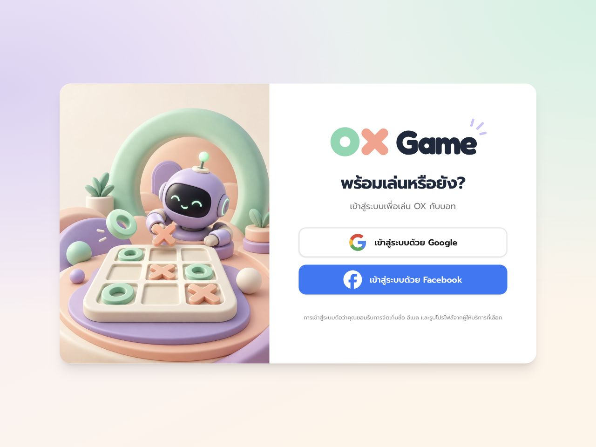
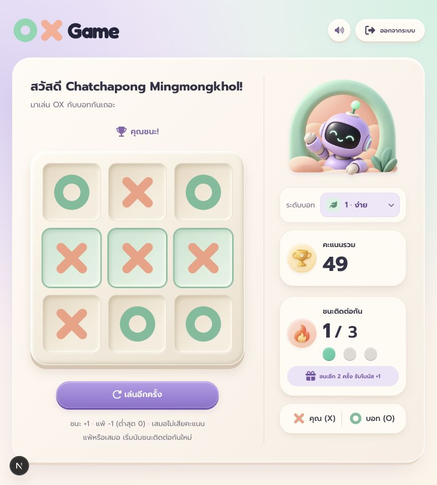

# OX Game

English | [ไทย](README-th.md)

A company technical assessment: a Tic-Tac-Toe web application with OAuth login,
three bot difficulty levels, persistent player scores, and win streak bonuses.
The pastel UI includes game sounds and a mute toggle. Game moves and scoring are validated on the server.

<table>
  <tr>
    <td width="50%"></td>
    <td width="50%"></td>
  </tr>
</table>

## Run locally

You need **Node.js 22.14 or newer** (Node 22 LTS recommended), npm, Docker with
Docker Compose, and OAuth credentials for at least one provider to sign in.

Clone the repository and open its directory:

```bash
git clone https://github.com/Ford-CcpMmk/ox-game.git
cd ox-game
cp .env.example .env
openssl rand -base64 32
```

Put the generated value in `BETTER_AUTH_SECRET` in `.env` and configure Google or
Facebook credentials as described below. The default `DATABASE_URL` matches `compose.yaml`.

```bash
npm ci
docker compose up -d --wait
npm run db:deploy
npm run db:generate
npm run dev
```

Open [localhost:3000](http://localhost:3000) and sign in.
`npm ci` installs Tailwind CSS, daisyUI, and Font Awesome and automatically generates the
Prisma Client. The explicit `db:generate` command can also be rerun after schema changes.
No MCP installation is required to run the application.

### OAuth configuration

Create your own OAuth application through [Google Cloud Console](https://console.cloud.google.com/)
or [Meta for Developers](https://developers.facebook.com/), then populate `.env`:

| Variable | Value |
| --- | --- |
| `GOOGLE_CLIENT_ID`, `GOOGLE_CLIENT_SECRET` | Credentials for a Google OAuth client of type Web application |
| `FACEBOOK_CLIENT_ID`, `FACEBOOK_CLIENT_SECRET` | Facebook Login App ID and secret |
| `BETTER_AUTH_URL` | Application URL; locally `http://localhost:3000` |
| `BETTER_AUTH_SECRET` | Random secret generated above |
| `DATABASE_URL` | PostgreSQL connection URL; the example uses local port 5433 |

Register the corresponding callback URL with your provider:

| Provider | Local callback URL |
| --- | --- |
| Google | `http://localhost:3000/api/auth/callback/google` |
| Facebook | `http://localhost:3000/api/auth/callback/facebook` |

For Google, also set the JavaScript origin to `http://localhost:3000`.
If the provider application is in testing mode, grant the reviewer's account access as a test user
or app member as appropriate. Configure at least one provider and use its sign-in button.
Buttons for unconfigured providers remain visible but cannot complete sign-in.
Restart the server after editing `.env`. Keep real credentials out of Git.

## Playing and scoring

Sign in at `/login`, start your first game, and click an empty cell to place X.
Choose the bot difficulty in the sidebar before the first move or after a round ends.

- You play X and move first; the bot plays O.
- The initial difficulty is **Level 1 (Easy)**.
- **Easy:** chooses a random free cell.
- **Medium:** blocks an immediate player win, otherwise chooses randomly.
- **Hard:** takes an immediate winning move, otherwise blocks an immediate loss, then chooses randomly.
- A win adds **1 point**; a loss subtracts **1 point**, with a minimum score of **0**.
- A draw leaves the score unchanged.
- Three consecutive wins award **1 extra point**, for a total of **4 points**, then reset the streak.
- A loss or draw resets the streak. All difficulty levels use the same scoring rules.
- Restart is disabled while an existing board is empty. Refreshing resumes the saved round.

Use the restart/replay button for another round. The sound toggle is next to the logout button;
logging out opens a confirmation dialog. The application interface is in Thai.

## Inspect all player scores

The tool provided for this requirement is **Prisma Studio**. Keep PostgreSQL running and
open another terminal in the project directory, using the same `.env` as the application:

```bash
npm run db:studio
```

Open the URL printed in the terminal and select the **`user`** table.
Each row represents a player:

| Column | Meaning |
| --- | --- |
| `name` | Player name |
| `email` | Sign-in email |
| `score` | Current total score |
| `winStreak` | Consecutive wins currently counted toward the next bonus |

Sort by `score` to compare players, or use Studio's search/filter controls.
A player appears after their first sign-in. The **`game`** table stores the latest board
and bot difficulty for each player, rather than a history of every round.
Studio connects directly to the database, so the reviewer needs the database environment.
There is no separate admin page or application role system.

## Requirement coverage

| Requirement | Implementation |
| --- | --- |
| Tic-Tac-Toe web application | Next.js game screen: player X versus bot O |
| Sign-in required; OAuth 2.0 authentication | Google/Facebook via Better Auth; unauthenticated visitors are redirected to login |
| Standard Tic-Tac-Toe rules | Server validates moves and detects wins and draws |
| Persistent player scores | PostgreSQL stores scores per account |
| Win +1; loss −1 | Scores update when a round ends, with a minimum of 0 |
| Extra +1 after three consecutive wins | Three consecutive wins total 4 points, then the streak resets |
| Tool to inspect every player's score | Prisma Studio, `user` table, as described above |

Draws leave points unchanged and reset the streak. The server checks game ownership and
board version, and saves moves and scoring in a transaction to prevent duplicate score awards.
The original assignment is in [docs/REQUIREMENTS.md](docs/REQUIREMENTS.md).

## Tests

```bash
npm run lint
npm run typecheck
npm test
```

`npm test` checks game rules, scoring, and server behavior using a simulated database.
It does not require PostgreSQL. One real-database integration test is intentionally **skipped**
in this command because it requires a running database and applied migrations.

After preparing the database with the setup commands above, run it separately:

```bash
npm run test:db
```

This verifies difficulty persistence and that concurrent winning requests award points only once.
Use a development/test database: the test creates a temporary player and removes that player's
data afterward.

## Production build

```bash
npm run build
npm start
```

Stop the development server first if it uses the same port, and provide all environment variables.
For another deployment URL, update `BETTER_AUTH_URL` and provider callbacks to match.
The build needs internet access to download Google Fonts.

## Stack

Next.js 16, React 19, TypeScript, Tailwind CSS 4, daisyUI 5, Font Awesome 7,
Better Auth, Prisma 7, and PostgreSQL 17. Exact dependency versions are locked in `package-lock.json`.

## Commands

| Command | Purpose |
| --- | --- |
| `npm run dev` | Start the development server |
| `npm run build` / `npm start` | Build and serve the production application |
| `npm run lint` / `npm run typecheck` | Check code quality and types |
| `npm test` | Run game and server tests with a simulated database |
| `npm run test:db` | Test transactions against a real development database |
| `npm run db:deploy` | Apply existing migrations |
| `npm run db:migrate -- --name describe_change` | Create a migration after changing the schema during development |
| `npm run db:generate` | Generate the Prisma Client; does not modify database tables |
| `npm run db:studio` | Inspect database records |

## Project structure

- `src/app`: routes, layout, and global theme
- `src/actions`: Server Actions accepting game requests from the client
- `src/components/game`: game screen, header, board, sidebar, difficulty picker, and X/O marks
- `src/components/auth`: sign-in and sign-out controls
- `src/hooks`: game state and audio
- `src/lib`: game rules, scoring, difficulty configuration, authentication, and database access
- `src/styles/game`: styles grouped by purpose; `ox-game.css` defines their import order
- `public/game-assets`: game images and sound files
- `prisma`: schema and migrations; `prisma.config.ts`: Prisma CLI configuration
- `tests`: automated tests

## Troubleshooting

- **Database connection fails:** check `docker compose ps` and `DATABASE_URL`. Local Docker exposes PostgreSQL on port **5433**.
- **OAuth sign-in fails:** check provider credentials, callback URLs, and test-account permissions.
- **Prisma Client is out of date:** run `npm run db:deploy` and `npm run db:generate`, then restart the server.
- **Port 3000 is occupied:** stop the process using it, or change the port and update the application URL and OAuth callbacks together.

Stop PostgreSQL while preserving data with `docker compose stop`.
Start it again with `docker compose up -d --wait`.
